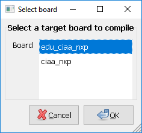
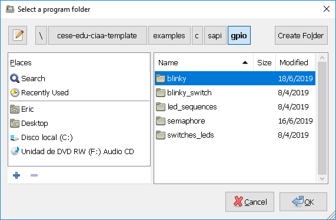
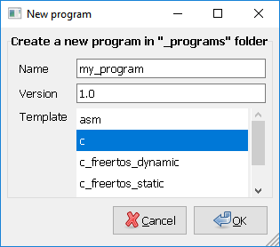

[](https://opensource.org/licenses/BSD-3-Clause) [](https://travis-ci.com/epernia/firmware_v3) (Travis CI status)

# Embedded Systems development Firmware in C/C++ 

## IMPORTANT

**This environment is under construction!!**

**Always use the [released versions](../../releases) because in these all examples are tested and the API documentation is consistent. The master branch may contain inconsistencies because this environment is currently under development. See the Travis CI tag above to know the status of this repository.**

## Available libraries:

- CMSIS 5.4.0 (Core and DSP). [CMSIS_5 Repository](https://github.com/ARM-software/CMSIS_5).
- LPCOpen v3.02 [LPCOpen Software Development Platform LPC43XX NXP website](https://www.nxp.com/design/microcontrollers-developer-resources/lpcopen-libraries-and-examples/lpcopen-software-development-platform-lpc43xx:LPCOPEN-SOFTWARE-FOR-LPC43XX).
- LPCUSBlib. [LPCUSBlib documentation](http://67.222.144.123/lpcopen/v1.03/group___l_p_c_u_s_blib.html)
- sAPI v0.5.2. [sAPI API Reference (spanish)](libs/sapi/documentation/api_reference_es.md).
- Elm-Chan FatFS R0.13b. [FatFS documentation](http://elm-chan.org/fsw/ff/00index_e.html). Generic FAT Filesystem module with support for SD Card (SSP) and Pendrive (USB MSD) disks.
- FreeRTOS Kernel V10.0.1. [FreeRTOS_Reference_Manual_V10.0.0.pdf](examples/c/freertos_book/FreeRTOS_Reference_Manual_V10.0.0.pdf).
- RKH 3.2.3 [RKH Reference Manual](https://vortexmakes.com/rkh/).

## Supported boards

- [CIAA-NXP (LPC4337)](documentation/CIAA_Boards/NXP_LPC4337/CIAA-NXP/CIAA-NXP%20v1.0%20Board%20-%202019-01-04%20v3r0.pdf).
- [EDU-CIAA-NXP (LPC4337)](documentation/CIAA_Boards/NXP_LPC4337/EDU-CIAA-NXP/EDU-CIAA-NXP%20v1.1%20Board%20-%202019-01-03%20v5r0.pdf).

## Supported toolchains

- gcc-arm-none-eabi 

## Usage

- Make sure you have an `arm-none-eabi-*` toolchain configured in your `PATH`. If you don't have it, download [GCC ARM Embedded](https://developer.arm.com/open-source/gnu-toolchain/gnu-rm).
- Make sure you have an `openocd` configured in your `PATH`.

### Select a target board to compile

- Create a `board.mk` text file inside this folder.
- Define `BOARD` variable in `board.mk` according to the board you want to compile.

**`board.mk` example default values:**

```makefile
BOARD = edu_ciaa_nxp
```

Note: If you have `zenity` installed (included in [CIAA Software](https://github.com/epernia/software/)), you can use:

- `make select_board` to select graphically a target board.



This will create automaticaly a `board.mk` text file inside this folder with the selected board.

### Select a program to compile

- Create a `program.mk` text file inside this folder.
- Define `PROGRAM_NAME`  and `PROGRAM_PATH` variables in `program.mk` according to the program you want to compile (PROGRAM_PATH is relative to this folder, leave void if the program is inside this folder).

**`program.mk` example default values:**

```makefile
PROGRAM_PATH = examples/c
PROGRAM_NAME = app
```

Note: If you have `zenity` installed, you can use:

- `make select_program` to select graphically a program.



This will create automaticaly a `program.mk` text file inside this folder with the selected program.

### Compile and download

- Compile with `make`.
- Download to target via OpenOCD with `make download`.
- Clean compilation with `make clean`.

### Create a new program

Each program consist in a folder (with a non-spaces name) that includes inside 2 folders, one named ```src``` (here go, .c, .cpp or .s source code files), and another one named ```inc``` (here go, .h or .hpp source header files). 

`program.c` example:

```c
#include "sapi.h"
int main( void )
{
   boardInit();
   while(1){
      gpioToggle(LED);
      delay(200);
   }
}
```

`program.h` example:

```c
#ifndef __ARCHIVO_H_
#define __ARCHIVO_H_
   // Your public declarations...
#endif
```

Also you can use a file named `config.mk`, where you may configure which libraries you include and compiler options.

`config.mk` example and default values:

```makefile
# Compile options
VERBOSE=n
OPT=g
USE_NANO=y
SEMIHOST=n
USE_FPU=y
# Libraries
USE_LPCOPEN=y
USE_SAPI=y
```

Program complete structure is:

```
+program
+--config.mk
+--+src
|  +--program.c
+--+inc
   +--program.h
```

Note: If you have `zenity` installed, you can use:

- `make new_program` to create graphically a program using program templates.



First time will ask you for your user preferences:


### Create a new global library

The `libs` folder include libraries that can be used fom any program (global libraries).

The `Makefile` allow you to include 2 types of libraries:

- Simple library. Consist in a folder (with a non-spaces name) that includes inside 2 folders, one named ```src``` (here go .c, .cpp or .s source code files), and another one named ```inc``` (here go .h or .hpp header files). This kind of library compiles automaticaly by the Makefile.
- Advanced library. Consist in a library with a complex folder and files structure, i.e. LibUSB. This case require make your own makefile. You can inspire from sAPI makefile to do that.

## Examples

Included examples are:

### ARM Cortex M4 Asembler

 - `asm_lpc_open`: assembler with LPC Open library
 - `asm_sapi`: assembler with sAPI library
 
### C language

 - **sAPI library**
    - Bare metal:
        - `adc_dac`: ADC and DAC example.
        - bluetooth
            - `hm10_uart_bridge`: Bluettoth HM10 module AT, tx and rx example.
        - `cycles_counter`: clock cycles counter functions, only work in debug mode. Allows execution time trazability.
        - `dht11_temp_humidity`: humidity and temperature sensor.
        - gpio
            - `gpio_01_switches_leds`: each switch drives the upper led.
            - `gpio_02_blinky`: the simply led blinky with a blocking delay.
            - `gpio_03_blinky_switch`: led blinky with a with a non-blocking delay, to allow you to respond to a switch at the same time.
            - `gpio_04_led_sequences`: led sequences by using a non-blocking delay.
        - `hcsr04_ultrasonic_sensor`:  HC-SR04 utrasonic distance sensor.
        - i2c:
            - IMUs
                - `mpu9250`: MPU9250 IMU 9DOF (Gyroscope, Accelerometer and Magnetometer) + Temperature.
            - magnetometers. In Chinese GY-273 module you can have one of this magnetometers, that have the same pinout but different register map. To difference them see the chip, ignore the board serigraphy.
                - `hmc5883l`: HMC5883L magnetometer. 
                - `qmc5883l`: QMC5883L magnetometer.
        - `keypad_7segment`: Drives a keypad and 7 segment display.
        - `lcd`: Drives a LCD display.
        - pwm
            - `pwm_01`: PWM applied to LEDs.
            - `pwm_02_rgb_controller_uart`: RGB LED example.
        - `rtc`: RTC peripheral to have date and time clock.
        - `sapi_basic_example`: a basic sAPI library example
        - `servo`: angular servomotor PWM control example.
        - spi_sd_card
            - `spi_sd_card_01_wite_file`: Wite a text file in a SD/MicroSD Card (SPI connected) by using a FAT File System (Elm-Chan FAT FS).
            - `spi_sd_card_02_log_time_stamp`: Wite a text file in a SD/MicroSD Card (SPI connected) by using a FAT File System (Elm-Chan FAT FS) add time-stamp in samples.
            - `spi_sd_card_03_list_files`: List files in a SD/MicroSD Card (SPI connected) by using a FAT File System (Elm-Chan FAT FS). Show results in UART.
        - `tick_hook`: periodic tick function (interrupt-based) with periodic callback.
        - uart
            - `uart_01_echo`: UART echo, it respond the same that you send from PC.
            - `uart_02_receive_string_blocking`: waits until receive a certain pattern String in a UART or timeout expire (blocking code). Don't save received string.
            - `uart_03_receive_string`: waits until receive a certain pattern String in a UART or timeout expire (non-blocking code). Don't save received string.
        - wifi_esp8266
            - `wifi_esp8266_01_uart_bridge`: use this to send AT commands directly to ESP01 module.
            - `wifi_esp8266_02_thingspeak`: send data to thingspeak dashboards.
        - usb
            - `usb_device_01_hid_keyboard`: USB Device. Board as USB Keyboard.
            - `usb_device_02_cdc_virtualSerialPort`: USB Device. Using USB OTG as a virtual serial port.
    - Operating Systems:
        - rtos_cooperative (see M.J. Pont's book at https://www.safetty.net/publications/pttes )
            - `scheduler_01_seos`: first cooperative scheduler
            - `scheduler_02_seos_background_foreground`: second cooperative scheduler
            - `seos_pont_2014_01_first_app`: third cooperative scheduler
        - rtos_freertos
            - dynamic_mem
                - `freeRTOS_01_blinky`
                - `freeRTOS_03_ChanFatFS_SPI_SdCard_ADC_log`: ADC logging in a SD/MicroSD Card (SPI connected) by using a FAT File System (ChanFS), freeRTOS and sAPI.
            - static_mem
                - `freeRTOS_01_blinky`
 - **LPC Open library**
    - bare_metal
        - `blinky`
        - `blinky_input`
        - `blinky_ram`
        - `blinky_rit`
        - `boot`
        - `i2c`
        - `lpc_open_basic_example`
        - `mpu`
        - `pwm`
    - operating_systems
        - `freertos_blinky`
    - statecharts
        - `statechart`
 - `newlib_printf_scanf`
 - `without_libs`
 
### C++ language

 - `cpp_sapi_basic_example`: a C++ basic example with sAPI library.
