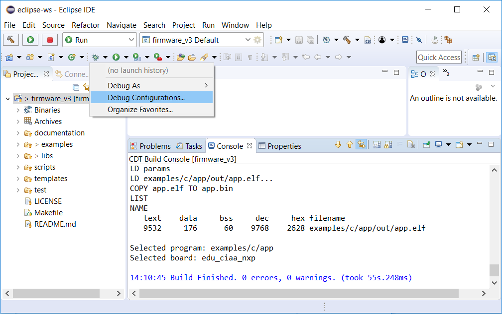
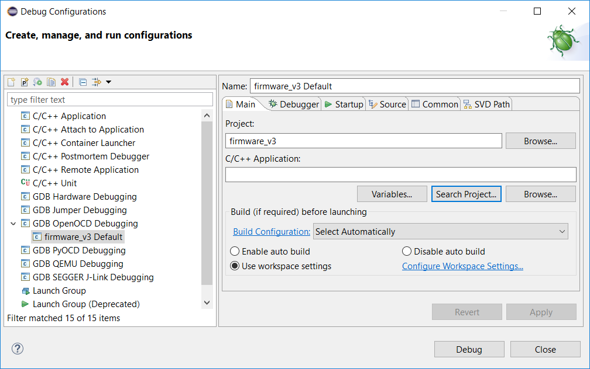
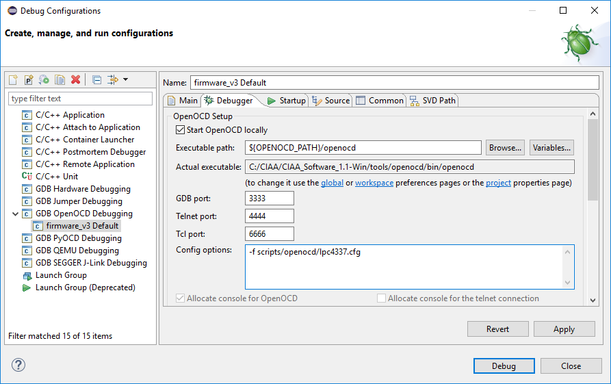
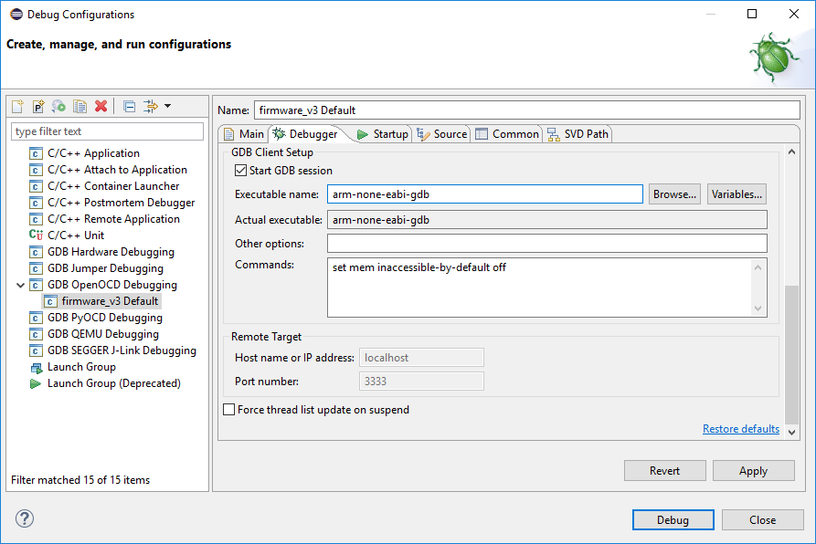
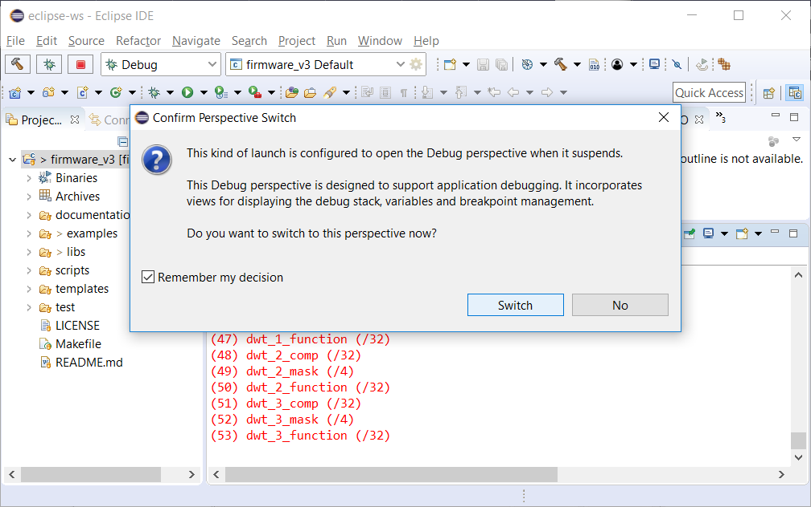
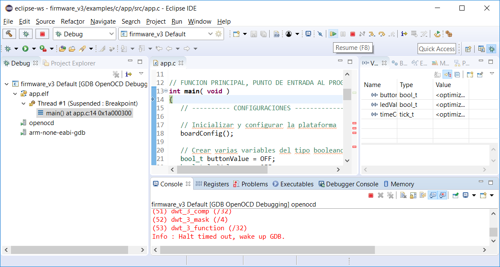
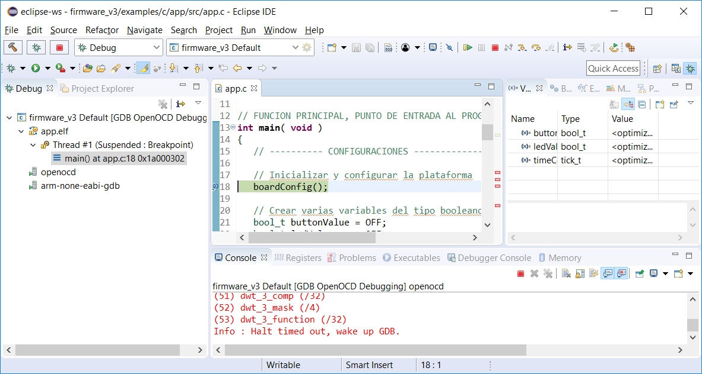

## Índice


# Depuración de un programa sobre la plataforma de hardware con Eclipse y firmware_v3

## 1. Configuración de la descarga y depuración del programa sobre el hardware

Ubique el ícono del bicho verde (*debug*) , presione sobre la flecha hacia abajo a la derecha de este icono y en la ventana que se despliega la opción "*Debug Configurations...*"



Esto abre la ventana de configuraciones:


A la izquierda realizar doble click sobre "*GDB OpenOCD Debugging*" que crea una nueva configuración:



En esta ventana se puede ver que proyecto está seleccionado (en este caso ```firmware_v3```) y el programa a descargar/depurar (campo de texto C/C++ Application:). 

Mediante el botón "*Search Project..*" puede elegir que programa va a descargar/depurar. 

**Nota**: recuerde que debe haber compilado previamente un programa. En este caso se muestra como ejemplo el programa ```app.elf```:


Seleccionarlo y presionar "*Ok*".


Ir a la pestaña "Debugger" donde deberá completar lo siguiente:

- Executable path: ```${OPENOCD_PATH}/openocd```
- Config options: ```-f scripts/openocd/lpc4337.cfg```



Deslice la pantalla más abajo y configure en la sección "*GDB Client Setup*":

- Executable name: ```arm-none-eabi-gdb```



Con esto ya se encuentra configurado el Eclipse para depurar. 

## 2. Probar el funcionamiento de la depuración sobre el hardware

Para probarlo presione sobre el botón "*Debug*". Aparecerá un mensaje como el siguiente la primera vez que avisa que el Eclipse pasará de la perspectiva de programación, a la de depuración (esto hace que se reacomoden vairos menues para facilitar la depuración). Presione "*Remember my decision*" y "*Switch*" para que no la muestre cada vez:



Cuando el programa se descargó a la plataforma y empezó a ejecutarlo dentendrá su ejecución al inicio de la función main().



## 3. Botones de control de ejecución y breakpoints

Mediante los botones de control de ejecución y breakpoints podremos controlar el programa que se ejecuta en la placa desde nuestra PC:


De izquierda a derecha:

- **Skip All Breakpoints (Ctrl+Alt+B)**. Habilitar/Deshabilitar breakpoints.
- **Resume (F8)**. Correr el código hasta el próximo breakpoint o de forma continua.
- **Suspend**. Detener la ejecución del programa.
- **Terminate (Ctrl+F2)**. Terminar sesión de debug con botón stop.
- **Connect/Disconnect**. Botón conectar o desconectar (siempre deshabilitado, no se utiliza en firmware_v3).
- **Step Into (F5)**. Ejecuta un paso dentro de la próxima función llamada.
- **Step Over (F6)**. Ejecuta un paso en una instrucción del código.
- **Step Return (F7)**. Ejecuta un paso fuera de la función actual. 

Además se puede *agregar o eliminar un breakpoint* mediante doble click en el área gris a la izquierda de las líneas de código).

En este ejemplo se puso un *beakpoint* en la función ```boardConfig()```:



## 4. Depurar otro programa dentro del mismo proyecto

Simplemente deberá compilar el otro programa y luego abrir la ventana "*Debug Configurations*" y mediante el botón "*Search Project..*" puede elegir que programa va a descargar/depurar:


**NOTA:**  Recuerde que previamente debe haber compilado el programa a depurar para que aparezca en la búsqueda.

Luego simplemente presionar sobre debug, el resto de las configuraciones que realizamos se hace una única vez.


## Más información

- [Configurar y ejecutar *targets* de de *makefile* en Eclipse](../targets/targets-es.md).
- [Volver al README](../../../readme/readme-es.md).
