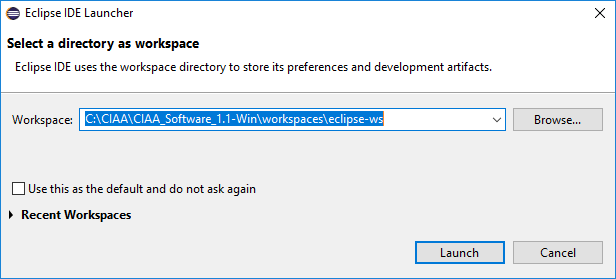
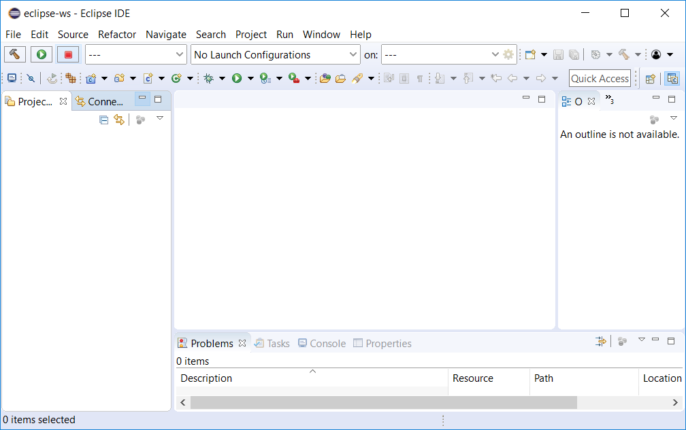
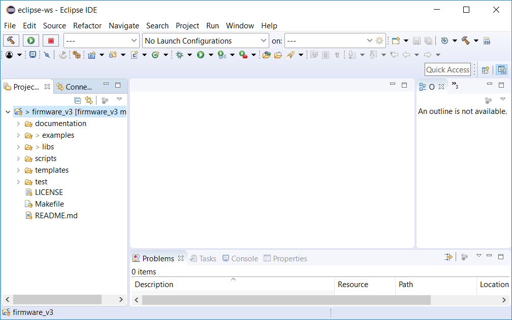

# Abrir proyecto firmware_v3 en Eclipse

## Abrir proyecto firmware_v3 en Eclipse por primera vez
### Iniciar Eclipse

Recordar iniciar Eclipse desde el Launcher. Esto traerá las variables de entorno necesarias para ubicar las herramientas externas para compilación y depuración.

### Workspace

Al abrir el Eclipse solicita seleccionar la carpeta a utilizar como espacio de trabajo (*Workspace*), elegir dentro de la ruta donde descomprimieron el Launcher la carpeta:

```
<rutaDondeDescomprimiElLauncher>/workspaces/eclipse-ws
```



### Ventana inicial

Al iniciar el Eclipse muestra una pestaña de bienvenida (*Wellcome*) como la siguiente:


Debe cerrar esta pestaña para que se muestre el árbol de proyectos y el espacio del editor de archivos:




### Abrir Proyecto de Firmware para programar en asembler, C o C++

Primero debemos clonar o descargar el Proyecto a abrir, en este caso firmware_v3:

https://github.com/epernia/firmware_v3

Ubicar la carpeta Firmware v3 dentro de la carpeta del Launcher. 

Luego en Eclipse ir al menú:

```
New --> Makefile Project with Existing Code
```


En la ventana que se abre deberá:

- Elegir mediante "Browse" la carpeta ```firmware_v3```
- Tildar en Languages ```C``` y ```C++```
- Elegir como Toolchain ```ARM Cross GCC```


Una vez realizado presione "Finish" y verá el Proyecto "firmware_v3" en el árbol de proyectos:



Con esto queda el proyecto firmware_v3 listo para su utilización. 

**Nota**: Eclipse puede tener múltiples proyectos en simultáneo dentro de un mismo *Workspace*. En particular, el proyecto *firmware_v3 es un único proyecto que se compone de múltiples programas* (los ejemplos que trae más los programas que realizaremos nosotros). Es decir con un único proyecto de Eclipse abierto tendremos la posibilidad de seleccionar que programa del mismo se desea compilar y descargar a la plataforma de hardware.

## Abrir proyecto firmware_v3 en Eclipse en sucesivas ocasiones

Eclipse guarda todas las configuraciones realizadas sobre la carpeta elegida como *Workspace* con y de esta manera al abrir nuevamente Eclipse y seleccionar el *Workspace* que hemos creado se cargará el proyecto firmware_v3 automáticamente.

## Más documentación

- [Compilar y descargar un programa del proyecto firmware_v3 en Eclipse](../build/build-es.md).
- [Volver al README](../../../readme/readme-es.md).
