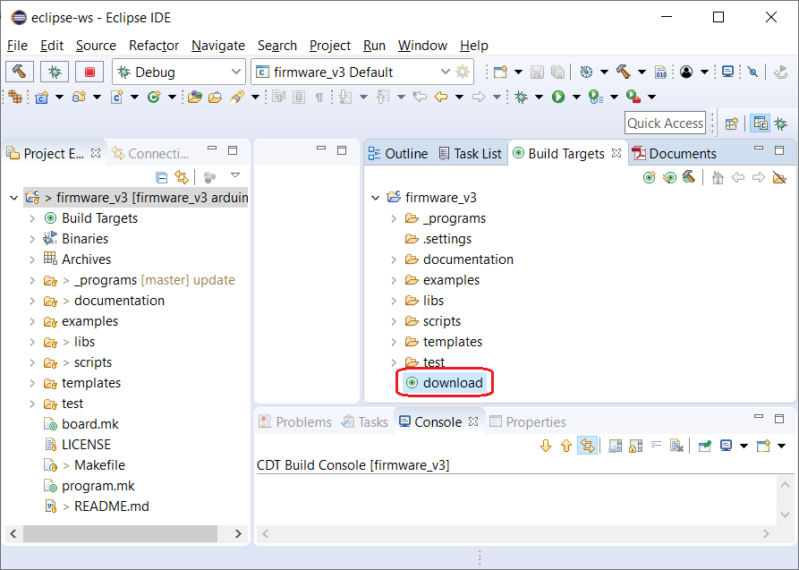

# Configurar y ejecutar *targets* de de *makefile* en Eclipse

## Targets por defecto en Eclipse

Eclipse muestra algunos de sus *targets* de diferentes maneras:

- El *target* **all** como el "botón del martillo" (***Build project***) accesible desde el menú superior.

  

El botón ***build*** ejecuta el comando:

`make all` 

- Si se presiona botón derecho del *mouse* sobre el proyecto firmware_v3 se muestran como opciones del menú contextual:

  - ***Build Project.*** Ejecuta el comando `make all` 
  - ***Clean Project.*** Ejecuta el comando `make clean` 

  

- Además se pueden configurar y agregar *targets* adicionales como se explica en la siguiente sección.

## Configurar *targets* de de *makefile* en Eclipse

Para agregar botones para ejecutar *targets* de de *makefile* en Eclipse se debe ir a la pestaña ***Build Targets*** (1), luego presionar en la carpeta ***firmware_v3*** (2) y luego presionar el botón ***New Build Target*** (3):

De esta forma se abre un formulario donde se agrega el nuevo target. Por ejemplo, para agregar el *target download*:

De esta forma el target queda accesible como un botón en eclipse como se muestra a continuación:

Se recomienda agregar los *targets*:

- `all` Compilar programa seleccionado.
- `clean` Eliminar archivos de compilaciones previas (remueve la carpeta *out* dentro del programa seleccionado). Es necesario ejecutarlo sobre le programa seleccionado al cambiar opciones de compilación del programa (archivo *config.mk*) o al cambiar la plataforma de hardware (*board*) para la cual se compilará el programa.
- `clean_all` Eliminar archivos de compilaciones previas de todos los programas dentro de la carpeta firmware_v3.
- `download` Descarga el programa seleccionado a la *board* seleccionada.
- `erase` Borra la flash de la *board* seleccionada. Es necesario resetear la plataforma luego de aplicarlo.
- `new_program` Permite gráficamente crear un nuevo programa dentro de la carpeta seleccionada por el usuario (la primera vez se pide el nombre de la carpeta donde se guardaran los programas y se crea dentro de la carpeta firmware_v3).
- `select_board` Permite elegir gráficamente la plataforma de hardware (*board*) para la cual se compilará el programa.
- `select_program` Permite elegir gráficamente el programa a utilizar (compilar, descargar, limpiar, etc.).

Se ejecutan realizando doble doble click sobre el icono de los mismos.

## Más documentación

- [Volver al README](../../../readme/readme-es.md).