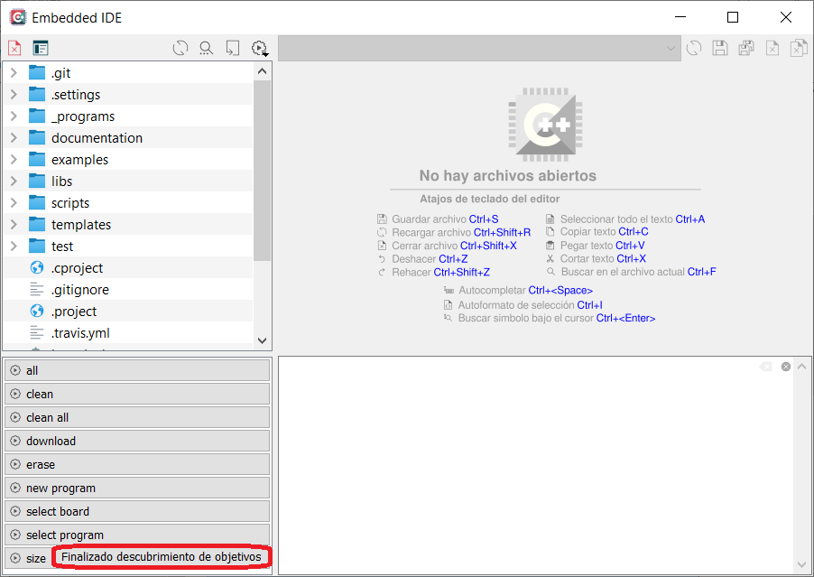

# Abrir el proyecto firmware_v3 en Embedded IDE

### Iniciar Embedded IDE

Recordar iniciar Embedded IDE desde el *Launcher*. Esto traerá las variables de entorno necesarias para ubicar las herramientas externas para compilación y depuración.

### Proyectos soportados por Embedded IDE

Embedded soporta proyectos en base a Makefile. Al abrir un proyecto con Makefile Embedded IDE busca automáticamente todos los objetivos (*targets*) del mismo y los presenta como botones accesibles en el panel inferior izquierdo del IDE.

### Abrir el proyecto firmware_v3

Para abrir el proyecto "firmware_v3" en Embedded IDE primero debe abrir el propio Embedded IDE y luego presionar sobre "Abrir proyecto" (o el atajo de teclado Ctrl+o) como se muestra a continuación:

Navegar hasta la ruta donde se encuentre la carpeta **firmware_v3** y seleccionar dentro de la misma el archivo **Makefile** (1) y luego presionar el botón **Abrir** (2):

Finalmente, al abrir el proyecto se realiza un búsqueda e indexación que luego de completarse se mostrará durante un segundo la leyenda **Finalizado descubrimiento de objetivos** para indicar que termino de abrir correctamente el proyecto y está listo para usarse, esto puede tardar varios segundos dependiendo de la velocidad de la PC:

## Más documentación

- [Ejecutar targets de makefile en Embedded IDE](../targets/targets-es.md).
- [Volver al README](../../readme/readme-es.md).

