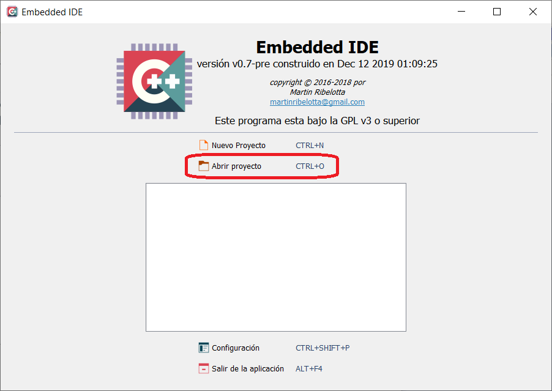
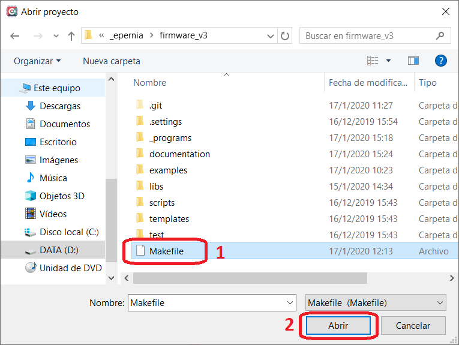
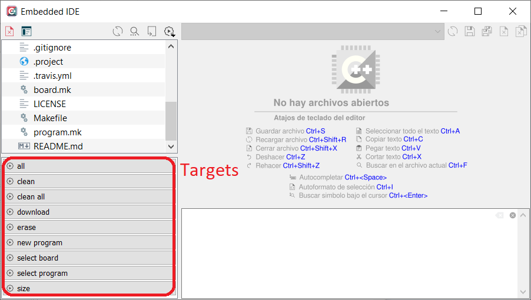

## Índice

<ul style="list-style:none;">
   <li><a style="text-decoration: none;" href="#utilización-de-firmware_v3-con-embedded-ide">Utilización de firmware_v3 con Embedded IDE</a></li>
   <ul style="list-style:none;">
      <li><a style="text-decoration: none;" href="#1-abrir-el-proyecto-firmware_v3-en-embedded-ide">1. Abrir el proyecto firmware_v3 en Embedded IDE</a></li>
      <ul style="list-style:none;">
         <li><a style="text-decoration: none;" href="#11-iniciar-embedded-ide">1.1. Iniciar Embedded IDE</a></li>
         <li><a style="text-decoration: none;" href="#12-proyectos-soportados-por-embedded-ide">1.2. Proyectos soportados por Embedded IDE</a></li>
         <li><a style="text-decoration: none;" href="#13-abrir-el-proyecto-firmware_v3">1.3. Abrir el proyecto firmware_v3</a></li>
      </ul>
      <li><a style="text-decoration: none;" href="#2-ejecutar-targets-de-makefile-en-embedded-ide">2. Ejecutar <em>targets</em> de <em>makefile</em> en Embedded IDE</a></li>
   </ul>
</ul>

# Utilización de firmware_v3 con Embedded IDE

## 1. Abrir el proyecto firmware_v3 en Embedded IDE

### 1.1. Iniciar Embedded IDE

Recordar iniciar Embedded IDE desde el *Launcher*. Esto traerá las variables de entorno necesarias para ubicar las herramientas externas para compilación y depuración.

### 1.2. Proyectos soportados por Embedded IDE

Embedded soporta proyectos en base a Makefile. Al abrir un proyecto con Makefile Embedded IDE busca automáticamente todos los objetivos (*targets*) del mismo y los presenta como botones accesibles en el panel inferior izquierdo del IDE.

### 1.3. Abrir el proyecto firmware_v3

Para abrir el proyecto "firmware_v3" en Embedded IDE primero debe abrir el propio Embedded IDE y luego presionar sobre "Abrir proyecto" (o el atajo de teclado Ctrl+o) como se muestra a continuación:

Navegar hasta la ruta donde se encuentre la carpeta **firmware_v3** y seleccionar dentro de la misma el archivo **Makefile** (1) y luego presionar el botón **Abrir** (2):

Finalmente, al abrir el proyecto se realiza un búsqueda e indexación que luego de completarse se mostrará durante un segundo la leyenda **Finalizado descubrimiento de objetivos** para indicar que termino de abrir correctamente el proyecto y está listo para usarse, esto puede tardar varios segundos dependiendo de la velocidad de la PC:

## 2. Ejecutar *targets* de *makefile* en Embedded IDE

Embedded IDE analiza el *Makefile* del proyecto firmware_v3 al abrirlo y coloca todos los *targets* (excepto si comienzan con punto "." en su nombre, los cuales están ocultos para Embedded IDE) como botones accesibles desde el panel inferior derecho del IDE como se muestra en la siguiente imagen:

## Más información

- [Volver al README](../readme/readme-es.md).