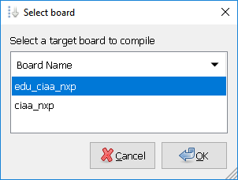
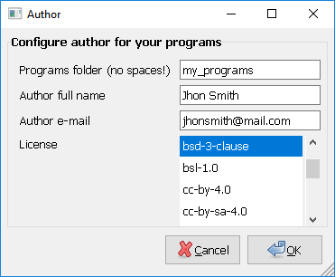

# firmware_v3 usage

- Make sure you have an `arm-none-eabi-*` toolchain configured in your `PATH`. If you don't have it, download [GCC ARM Embedded](https://developer.arm.com/open-source/gnu-toolchain/gnu-rm).
- Make sure you have an `openocd` configured in your `PATH`.

## Select a target board to compile

- Create a `board.mk` text file inside this folder.
- Define `BOARD` variable in `board.mk` according to the board you want to compile.

**`board.mk` example default values:**

```makefile
BOARD = edu_ciaa_nxp
```

Note: If you have `zenity` installed (included in [CIAA Software](https://github.com/epernia/software/)), you can use:

- `make select_board` to select graphically a target board.



This will create automaticaly a `board.mk` text file inside this folder with the selected board.

## Select a program to compile

- Create a `program.mk` text file inside this folder.
- Define `PROGRAM_NAME`  and `PROGRAM_PATH` variables in `program.mk` according to the program you want to compile (PROGRAM_PATH is relative to this folder, leave void if the program is inside this folder).

**`program.mk` example default values:**

```makefile
PROGRAM_PATH = examples/c
PROGRAM_NAME = app
```

Note: If you have `zenity` installed, you can use:

- `make select_program` to select graphically a program.


This will create automaticaly a `program.mk` text file inside this folder with the selected program.

## Compile and download

- Compile with `make`.
- Download to target via OpenOCD with `make download`.
- Clean compilation with `make clean`.

## Create a new program

Each program consist in a folder (with a non-spaces name) that includes inside 2 folders, one named ```src``` (here go, .c, .cpp or .s source code files), and another one named ```inc``` (here go, .h or .hpp source header files). 

`program.c` example:

```c
#include "sapi.h"
int main( void )
{
   boardInit();
   while(1){
      gpioToggle(LED);
      delay(200);
   }
}
```

`program.h` example:

```c
#ifndef __ARCHIVO_H_
#define __ARCHIVO_H_
   // Your public declarations...
#endif
```

Also you can use a file named `config.mk`, where you may configure which libraries you include and compiler options.

`config.mk` example and default values:

```makefile
# Compile options
VERBOSE=n
OPT=g
USE_NANO=y
SEMIHOST=n
USE_FPU=y
# Libraries
USE_LPCOPEN=y
USE_SAPI=y
```

Program complete structure is:


**Note:** If you have `zenity` installed, you can use:

- `make new_program` to create graphically a program using program templates.


**Note**: First time will ask you for your user preferences:



## Create a new global library

The `libs` folder include libraries that can be used fom any program (global libraries).

The `Makefile` allow you to include 2 types of libraries:

- Simple library. Consist in a folder (with a non-spaces name) that includes inside 2 folders, one named ```src``` (here go .c, .cpp or .s source code files), and another one named ```inc``` (here go .h or .hpp header files). This kind of library compiles automaticaly by the Makefile.
- Advanced library. Consist in a library with a complex folder and files structure, i.e. LibUSB. This case require make your own makefile. You can inspire from sAPI makefile to do that.


## More information 

[Back to README](../readme/readme-en.md).