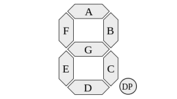
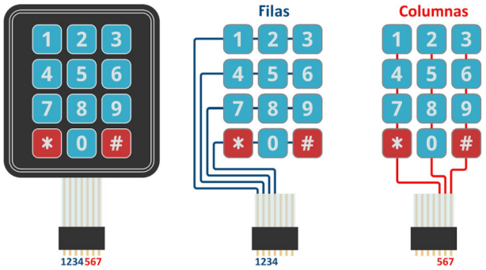

# API de la biblioteca sAPI

## Módulos

### DataTypes

Define las siguientes constantes:

Estados lógicos

- ``FALSE = 0``
- ``TRUE  = !FALSE``

Estados funcionales

- ``ON  = 1``
- ``OFF = 0``

Estados eléctricos

- ``HIGH = 1``
- ``LOW  = 0``

Estados de habilitación

- ``ENABLE  = 1``
- ``DISABLE = 0``

Además define los tipos de datos:

- **Booleano** ``bool_t``
- **Enteros sin signo** ``uint8_t, uint16_t, uint32_t, uint64_t``
- **Enteros con signo** ``int8_t, int16_t, int32_t, int64_t``
- **Flotantes** ``float32_t, float64_t``
- **String** ``string_t`` *(lo modelamos?? imagino una struct con el puntero al array y el tamaño)*

El tipo de datos para el conteo de tiempo en la unidad Tick

``typedef uint64_t tick_t;``

Un tipo de datos para puntero a función:

``typedef bool_t (*sapiFuncPtr_t)(void *);``

- Parámetro: ``void *`` Para poder pasar cualquier argumento.
- Retorna: ``bool_t`` Para reportar errores (TRUE si todo está bien).

Utilizando este tipo de datos define la finción Nula que no hace nada y Retorna
siempre TRUE, esta se utiliza para evitar errores de NULL POINTER.

``bool_t sapiNullFuncPtr(void *);``

- Parámetro: ``void *`` No usado.
- Retorna: ``bool_t``Retorna siempre TRUE.

### Peripheral Map

Contiene el mapa de periféricos.

**GPIO Map**

EDU-CIAA-NXP:

- P1 header

	``T_FIL0, T_FIL1, T_FIL2, T_FIL3, 
	 T_COL0,  T_COL1, T_COL2, 
	 CAN_TD, CAN_RD, 
	 RS232_TXD, RS232_RXD``

	``GPIO25, GPIO26, GPIO27, GPIO28, 
	 GPIO29, GPIO30, GPIO31, 
	 GPIO32, GPIO33, 
	 GPIO34, GPIO35``

- P2 header

	``GPIO0, GPIO1, GPIO2, GPIO3, GPIO4, GPIO5, GPIO6, GPIO7, GPIO8
	 LCD1, LCD2, LCD3, LCD4, LCDEN, LCDRS,
	 SPI_MISO, SPI_MOSI,
	 ENET_TXD0, ENET_TXD1, ENET_TXEN, ENET_RXD0, ENET_RXD1, ENET_MDIO, ENET_CRS_DV, ENET_MDC,``

	``GPIO0, GPIO1, GPIO2, GPIO3, GPIO4, GPIO5, GPIO6, GPIO7, GPIO8
	 GPIO9, GPIO10, GPIO11, GPIO12, GPIO13, GPIO14,
	 GPIO15, GPIO16,
	 GPIO17, GPIO18, GPIO19, GPIO20, GPIO21, GPIO22, GPIO23, GPIO24,``

- Switches

	``TEC1,  TEC2,  TEC3,  TEC4``

- Leds

	``LED1,  LED2,  LED3,  LEDR,  LEDG,  LEDB``

CIAA-NXP:

``DI0,   DI1,   DI2,   DI3,   DI4,   DI5,   DI6,   DI7,
 DO0,   DO1,   DO2,   DO3,   DO4,   DO5,   DO6,   DO7``

**ADC Map**

EDU-CIAA-NXP: ``CH1, CH2, CH3``

EDU-CIAA-NXP: ``ADC0CH0, ADC0CH1, ADC0CH2``

CIAA-NXP: ``AI0, AI1, AI2, AI3``

**DAC Map**

EDU-CIAA-NXP: ``DAC``

CIAA-NXP: ``AO``

**Uart Map**

``UART_USB, UART_232, UART_485``
``UART0, UART1, UART2``

**Timer Map**

``TIMER0, TIMER1, TIMER2, TIMER3, TIMER4``

**Pwm Map**

``PWM0, PWM1, PWM2, PWM3, PWM4, PWM5, PWM6, PWM7, PWM8, PWM9, PWM10``

**Servo Map**

``SERVO0, SERVO1, SERVO2, SERVO3, SERVO4, SERVO5, SERVO6, SERVO7, SERVO8``

**I2C Map**

``I2C0``

### GPIO

Manejo de Entradas y Salidas (booleanas) de propósito general.

**Configuración inicial y modo de una entrada o salida**

``bool_t gpioConfig( gpioMap_t pin, gpioConfig_t config );``

- Parámetro: ``gpioMap_t pin`` pin a configurar (ver GPIO Map).
- Parámetro: ``gpioConfig_t config`` configuración.
- Retorna: ``bool_t`` TRUE si la configuración es correcta.

Posibles configuraciones:

- ``GPIO_ENABLE`` Habilita las entradas y salidas de porpósito general.
- ``GPIO_INPUT, GPIO_INPUT_PULLUP, GPIO_INPUT_PULLDOWN, GPIO_INPUT_PULLUP_PULLDOWN`` Pin configurado como entrada en sus distintas variantes.
- ``GPIO_OUTPUT`` Pin configurado como salida.

**Lectura de Entrada**

``bool_t gpioRead( gpioMap_t pin );``

- Parámetro: ``gpioMap_t pin`` pin a leer (ver GPIO Map).
- Retorna: ``bool_t`` valor de la entrada.

**Escritura de Salida**

``bool_t gpioWrite( gpioMap_t pin, bool_t value );``

- Parámetro: ``gpioMap_t pin`` pin a escribir (ver GPIO Map).
- Parámetro: ``bool_t value`` valor a escribir en el pin.
- Retorna: ``bool_t`` FALSE en caso de errores.

### Tick

**Configuración de interrupción periódica**

``bool_t tickConfig(tick_t tickRateMSvalue, sAPI_FuncPtr_t tickHook );``

- Parámetro: ``tick_t tickRateMSvalue`` cada cuantos ms ocurre un tick.
- Parámetro: ``sAPI_FuncPtr_t tickHook`` función a ejecutar en cada tick.
- Retorna: ``bool_t`` TRUE en en caso correcto o FALSE en caso de errores.

Configura una interrupción periódica de temporizador cada tickRateMSvalue
milisegundos para utilizar de base de tiempo del sistema. Una vez ejecutada
esta función se dice que ocurre un tick del sistema cada tickRateMSvalue
milisegundos.

La tasa de ticks en ms, tickRateMS, es un parámetro con rango de 1 a 50 ms.

Además de aumentar el conteo de ticks en cada interrupción, la función
tickConfig ejecuta la función pasada como parámero cada vez que ocurre un tick.
Si no se desea ejecutar ninguna función debe poner en cero este parámetro.

**Leer la variable del conteo actual de ticks**

``tick_t tickRead( void );``

- Parámetro: ``void`` sin parámetro.
- Retorna: ``tick_t`` el valor actual del contador de ticks.

La variable del conteo actual de ticks se incrementa en 1 cada tickRateMSvalue
milisegundos.

**Escribir la variable del conteo actual de ticks**

``void tickWrite( tick_t ticks );``

- Parámetro: ``tick_t ticks`` el nuevo valor a setear del contador de ticks.
- Retorna: ``void``

Se utiliza si se necesita cambiar el valor del contador de ticks, por ejemplo,
para resetearlo.

En la implementación para la CIAA utiliza internaente el peiférico temporizador
Systick para configurar una interrupción periódica.

### Delay

Para utilizar los retardos (con excepción del retardo inexacto) se debe
configurar el Tick ya que utiliza estas interrupciones como base de tiempo.

Todos los tiempos de parámetros están en milisegundos.

Define la constante ``#define INACCURATE_TO_MS 20400`` y contiene las funciones:

**Retardo inexacto bloqueante** ``void delayInaccurate( tick_t delay_ms );``

- Parámetros: ``tick_t delay_ms`` tiempo de duración del retardo en ms.
- Retorna: ``void``

Utiliza un bloque for bloqueante que tiene una constante calculada "a ojo"
(INACCURATE_TO_MS) para perder muchos ciclos de reloj y lograr hacer un retado.

**Retardo bloqueante** ``void delay ( tick_t time );``

- Parámetros: ``tick_t time``
- Retorna: ``void``

Utiliza el conteo de ticks para determinar el tiempo transcurrido resultando en
un retardo exacto. Es bloqueante pues se queda en un bucle while hasta que se
cuentan los ticks necesarios para lograr el tiempo especificado.

**Retardo no bloqueante**

Este tipo de retardo permite realizar otras tareas mientras se ejecuta ya que
simplemente se chequea si el tiempo de retardo se ha arribado en lugar de
quedarse bloqueado esperando a que se complete el tiempo como en los casos
anteriores.

Define el tipo de datos estructurado ``delay_t``

Contiene las funciones:

``void delayConfig( delay_t* delay, tick_t duration );``

- Parámetro: ``delay_t * delay`` dirección de memoria de una variable del tipo delay_t.
- Parámetro: ``tick_t duration`` tiempo de duración del retardo en ms.
- Retorna: ``void``

``bool_t delayRead( delay_t* delay );``

- Parámetro: ``delay_t* delay`` dirección de memoria de una variable del tipo delay_t.
- Retorna: ``bool_t`` TRUE cuando el delay se cumplió, FALSE en caso contrario.

``void delayWrite( delay_t* delay, tick_t duration );``

- Parámetro: ``delay_t* delay`` dirección de memoria de una variable del tipo delay_t.
- Parámetro: ``tick_t duration`` tiempo de duración del retardo en ms.
- Retorna: ``void``

Uso:

Se utiliza declarando una variable de estructura del tipo delay_t, por ejemplo:

``delay_t myDelay;``

Luego, se configura inicialmente pasando como parámetro la variable recién
declarada

``delayConfig( &myDelay, 500 );``

Se detecta con un bloque if si se cumplió el delay leyéndolo con

``delayRead( &myDelay );``

La primera vez que se ejecuta delayRead activa el mismo. delayRead devuelve TRUE
cuando se completo y se vuelve a relanzar automáticamente.

Con ``delayWrite( &myDelay, 1000 );`` se puede cambiar la duración de un delay
en tiempo de ejecución.

### ADC

Manejo de conversor analógico-digital.

**Configuración inicial de conversor analógico-digital**

``void adcConfig( adcConfig_t config );``

- Parámetro: ``adcConfig_t config`` configuración.
- Retorna: ``void``.

Posibles configuraciones:

- ``ADC_ENABLE`` Habilita el periférico ADC.
- ``ADC_DISABLE`` Deshabilita el periférico ADC.

**Lectura de Entrada analógica**

``uint16_t adcRead( adcMap_t analogInput );``

- Parámetro: ``adcMap_t analogInput`` pin a leer (ver ADC Map).
- Retorna: ``uint16_t`` el valor actual de la entrada analógica.

### DAC

Manejo de conversor digital-analógico.

**Configuración inicial de conversor digital-analógico**

``void dacConfig( dacConfig_t config );``

- Parámetro: ``dacConfig_t config`` configuración.
- Retorna: ``void``.

Posibles configuraciones:

- ``DAC_ENABLE`` Habilita el periférico DAC.
- ``DAC_DISABLE`` Deshabilita el periférico DAC.

**Escritura de Salida analógica**

``void dacWrite( dacMap_t analogOutput, uint16_t value );``

- Parámetro: ``dacMap_t analogOutput`` pin a escribir (ver DAC Map).
- Parámetro: ``uint16_t value`` valor del pin a escribir.
- Retorna: ``void``.

### UART

Manejo del periférico de comunicación UART (puerto serie asincrónico).

**Configuración**

``void uartConfig( uartMap_t uart, uint32_t baudRate )``

- Parámetro: ``uartMap_t uart`` UART a configurar (ver UART MAP).
- Parámetro: ``uint32_t baudRate`` tasa de  bits.
- Retorna: ``void``.

Posibles configuraciones de baudRate: ``9600, 57600, 115200, etc.``

**Recibir Byte**

``bool_t uartReadByte( uartMap_t uart, uint8_t* receivedByte );``

- Parámetro: ``uartMap_t uart`` UART a configurar (ver UART Map).
- Parámetro: ``uint8_t* byte`` Dirección de memoria a donde se escribirá el dato recibido en caso de que haya un dato para recibir.
- Retorna: ``bool_t`` TRUE si recibió un dato, FALSE en caso contrario.

**Enviar Byte**

``void uartWriteByte( uartMap_t uart, uint8_t byte );``

- Parámetro: ``uartMap_t uart`` UART a configurar (ver UART Map).
- Parámetro: ``uint8_t byte`` Byte a enviar.
- Retorna: ``void``.

**Enviar String**

``void uartWriteString( uartMap_t uart, char* str );``

- Parámetro: ``uartMap_t uart`` UART a configurar (ver UART Map).
- Parámetro: ``char* str`` String a enviar, puede ser un literal, por ejemplo "hola", o un vector de uint8_t terminado en 0 o '\0' (caracter NULL).
- Retorna: ``void``.

### I2C

Manejo del periférico bus comunicación I2C (Inter Integrated Circuits).

**Configuración**

``bool_t i2cConfig( i2cMap_t i2cNumber, uint32_t clockRateHz );``

- Parámetro: ``i2cMap_t i2cNumber`` I2C a configurar (ver I2C Map).
- Parámetro: ``uint32_t clockRateHz`` configuración de velocidad del bus I2C.
- Retorna: ``bool_t`` TRUE si la configuración es correcta.

Posibles configuraciones de clockRateHz: 100000, etc.

**Lectura**

``bool_t i2cRead( i2cMap_t  i2cNumber,
                  uint8_t  i2cSlaveAddress,
                  uint8_t* dataToReadBuffer,
                  uint16_t dataToReadBufferSize,
                  bool_t   sendWriteStop,
                  uint8_t* receiveDataBuffer,
                  uint16_t receiveDataBufferSize,
                  bool_t   sendReadStop );``

- Parámetro: ``i2cMap_t i2cNumber`` I2C a leer (ver I2C Map).
- Parámetro: ``uint8_t i2cSlaveAddress`` Dirección del sensor conectado por I2C a leer.
- Parámetro: ``uint8_t* dataToReadBuffer`` puntero al buffer con los bytes a escribir para indicar que se debe leer.
- Parámetro: ``uint16_t dataToReadBufferSize`` tamaño del buffer con los bytes a escribir.
- Parámetro: ``bool_t sendWriteStop`` setear en 1 para enviar stop al finalizar el comando de escritura, con 0 no se envía. Algunos periféricos pueden no necesitar el stop.
- Parámetro: ``uint8_t* receiveDataBuffer`` puntero al buffer donde se almacenarán los datos leídos.
- Parámetro: ``uint16_t receiveDataBufferSize`` tamaño del buffer donde se almacenarán los datos leídos.
- Parámetro: ``bool_t sendReadStop`` setear en 1 para enviar stop al finalizar el comando de lectura, con 0 no se envía. Algunos periféricos pueden no necesitar el stop.
- Retorna: ``bool_t`` TRUE si se pudo leer correctamente.

**Escritura**

``bool_t i2cWrite( i2cMap_t  i2cNumber,
                   uint8_t  i2cSlaveAddress,
                   uint8_t* transmitDataBuffer,
                   uint16_t transmitDataBufferSize,
                   bool_t   sendWriteStop );``

- Parámetro: ``i2cMap_t i2cNumber`` ID de periférico I2C a escribir (ver I2C Map). Actualmente funciona únicamente el I2C0.
- Parámetro: ``uint8_t i2cSlaveAddress`` Dirección del sensor conectado por I2C a escribir.
- Parámetro: ``uint8_t* transmitDataBuffer`` puntero al buffer donde se encuentran los datos a escribir.
- Parámetro: ``uint16_t transmitDataBufferSize`` tamaño del buffer donde se encuentran los datos a escribir.
- Parámetro: ``bool_t sendWriteStop`` setear en 1 para enviar stop al finalizar el comando de escritura, con 0 no se envía. Algunos periféricos pueden no necesitar el stop.
- Retorna: ``bool_t`` TRUE si se pudo escribir correctamente.

### Sleep

Manejo de modos de bajo consumo del microcontrolador.

**Dormir hasta que ocurra la próxima interrupción**

``void sleepUntilNextInterrupt( void );``

- Parámetro: ninguno.
- Retorna: nada.

### RTC

Manejo del periférico RTC (reloj de tiempo real).

**Configuración**

``bool_t rtcConfig( rtc_t * rtc );``

- Parámetro: ``rtc_t * rtc`` Puntero a estructura de configuración del tipo RTC_t.
- Retorna: ``bool_t`` TRUE si la configuración es correcta.

La estructura del tipo ``RTC_t`` contiene los parámetros:

- ``uint16_t year`` año, con valores desde 1 a 4095.
- ``uint8_t month`` mes, con valores desde 1 a 12.
- ``uint8_t mday`` día, con valores desde 1 a 31.
- ``uint8_t wday`` día de la semana, con valores desde 1 a 7.
- ``uint8_t hour`` horas, con valores desde 0 a 23.
- ``uint8_t min`` minutos, con valores desde 0 a 59.
- ``uint8_t sec`` segundos, con valores desde 0 a 59.

**Lectura de fecha y hora**

``bool_t rtcRead( rtc_t * rtc );``

- Parámetro: ``rtc_t * rtc`` Puntero a estructura del tipo RTC_t donde se guarda la fecha y hora.
- Retorna: ``bool_t`` TRUE.

**Establecer la fecha y hora**

``bool_t rtcWrite( rtc_t * rtc );``

- Parámetro: ``rtc_t * rtc`` Puntero a estructura del tipo RTC_t con la nueva fecha y hora a setear.
- Retorna: ``bool_t`` TRUE.

### PWM

Manejo de salidas PWM (modulación por ancho de pulso). En la EDU-CIAA-NXP se
utiliza internamente el periférico SCT para generar los PWM.

**Configuración**

``bool_t pwmConfig( pwmMap_t pwmNumber, pwmConfig_t config);``

- Parámetro: ``pwmMap_t pwmNumber`` pin a configurar como salida PWM (ver PWM Map).
- Parámetro: ``uint8_t config`` configuración.
- Retorna: ``bool_t`` TRUE si la configuración es correcta.

Posibles configuraciones:

- ``PWM_ENABLE`` habilita el o los Timers en modo PWM.
- ``PWM_DISABLES`` deshabilita el o los Timers en modo PWM.
- ``PWM_ENABLE_OUTPUT`` habilita la salida PWM particular.
- ``PWM_DISABLE_OUTPUT`` deshabilita la salida PWM particular.

**Lectura del ciclo de trabajo (duty cycle) de la salida PWM**

``uint8_t pwmRead( pwmMap_t pwmNumber );``

- Parámetro: ``pwmMap_t pwmNumber`` salida PWM a leer el ciclo de trabajo.
- Retorna: ``uint8_t`` el ciclo de trabajo de la salida PWM.

 **Establecer el ciclo de trabajo de la salida PWM**

``bool_t pwmWrite( pwmMap_t pwmNumber, uint8_t percent );``

- Parámetro: ``pwmMap_t pwmNumber`` salida PWM a leer el ciclo de trabajo.
- Parámetro: ``uint8_t percent`` valor de ciclo de trabajo a setear en la salida PWM.
- Retorna: ``bool_t`` TRUE.

### Servo

Manejo de salidas para Servomortores angulares (usan modulación por ancho de pulso). En la EDU-CIAA-NXP se utilizan internamente los periféricos TIMER para
generar estas salidas.

**Configuración**

``bool_t servoConfig( servoMap_t servoNumber, servoConfig_t config );``

- Parámetro: ``servoMap_t servoNumber`` pin a configurar como salida Servo (ver Servo Map).
- Parámetro: ``servoConfig_t config`` configuración.
- Retorna: ``bool_t`` TRUE si la configuración es correcta.

Posibles configuraciones:

- ``SERVO_ENABLE`` habilita el o los Timers en modo PWM para Servo.
- ``SERVO_DISABLE`` deshabilita el o los Timers en modo PWM para Servo.
- ``SERVO_ENABLE_OUTPUT`` habilita la salida PWM particular.
- ``SERVO_DISABLE_OUTPUT`` deshabilita la salida PWM particular.

**Lectura del valor angular actual de la salida Servo**

``uint16_t servoRead( servoMap_t servoNumber);``

- Parámetro: ``servoMap_t servoNumber`` pin como salida Servo a leer.
- Retorna: ``uint16_t`` el valor angular actual de la salida Servo (de 0 a 180°).

**Establecer el valor angular de la salida Servo**

``bool_t servoWrite( servoMap_t servoNumber, uint16_t angle );``

- Parámetro: ``servoMap_t servoNumber`` pin como salida Servo a escribir.
- Parámetro: ``uint16_t angle`` valor angular a establecer en la salida Servo (de 0 a 180°).
- Retorna: ``bool_t`` TRUE.

### Display 7 segmentos

**Configuración**

Configurar los pines conectados al display 7 segmentos como salida:

``void display7SegmentPinConfig( gpioMap_t* display7SegmentPins );``

- Parámetro: ``gpioMap_t* display7SegmentPins`` puntero a un vector con los 8 pines conectados al display 7 segmentos, deben estar en el orden *a* a *h*.
- Retorna: nada.

Ejemplo:

``uint8_t display7Segment[8] = {
    GPIO5, // Segment 'a'
    GPIO7, // Segment 'b'
    GPIO6, // Segment 'c'
    GPIO1, // Segment 'd'
    GPIO2, // Segment 'e'
    GPIO4, // Segment 'f'
    GPIO3, // Segment 'g'
    GPIO8  // Segment 'h' or 'dp'
 };``

Testear en que orden están conectados los pines a los segmentos *a* a *h*:

``void display7SegmentTestPins( gpioMap_t* display7SegmentPins, gpioMap_t pin );``

- Parámetro: ``gpioMap_t* display7SegmentPins`` puntero a un vector con los 8 pines conectados al display 7 segmentos, deben estar en el orden *a* a *h*.
- Parámetro: ``gpioMap_t pin`` un pin aparte que indica cuando escribe el segmento *a* para iniciar la secuencia de la *a* a *h*. Por ejemplo, LEDB.
- Retorna: nada.

Mediante esta función se puede completar la siguiente tabla que indica a qué pines se conecto el display 7 segmentos:

| Segmento encendido     | Valor Binario | Valor Hexadecimal | Pin de salida |
|:----------------------:|:-------------:|:-----------------:|:-------------:|
| Segmento 'a' encendido | 0b00000001    |   0x20            | (a completar) |
| Segmento 'b' encendido | 0b00000010    |   0x80            |               |
| Segmento 'c' encendido | 0b00000100    |   0x40            |               |
| Segmento 'd' encendido | 0b00001000    |   0x02            |               |
| Segmento 'e' encendido | 0b00010000    |   0x04            |               |
| Segmento 'f' encendido | 0b00100000    |   0x10            |               |
| Segmento 'g' encendido | 0b01000000    |   0x08            |               |
| Segmento 'h' encendido | 0b10000000    |   0x80            |               |

**Escribir símbolo en display 7 segmentos**

Escribe un símbolo en el display 7 segmentos.

``void display7SegmentWrite( gpioMap_t* display7SegmentPins, uint8_t symbolIndex );``

- Parámetro: ``gpioMap_t* display7SegmentPins`` puntero a un vector con los 8 pines conectados al display 7 segmentos, deben estar en el orden *a* a *h*.
- Parámetro: ``uint8_t symbolIndex`` índice del valor a mostrar de la tabla de símbolos.
- Retorna: nada.

Tabla de símbolos:

``0, 1, 2, 3, 4, 5, 6, 7, 8, 9, 
 a, b, c, d, e, f,
 A, C, E, H, J, L, P, U
 ., DISPLAY_OFF``

### Teclado matricial

**Configuración**

``bool_t keypadConfig( keypad_t* keypad,
                      gpioMap_t* keypadRowPins, uint8_t keypadRowSize,
                      gpioMap_t* keypadColPins, uint8_t keypadColSize );``

- Parámetro: ``keypad_t* keypad`` puntero a estructura del teclado matricial donde se almacenan todos los parámetros necesarios del mismo.
- Parámetro: ``gpioMap_t* keypadRowPins`` puntero a vector que contiene la lista de pines conectados a las filas del teclado matricial.
- Parámetro: ``uint8_t keypadRowSize`` cantidad de filas del teclado matricial.
- Parámetro: ``gpioMap_t* keypadColPins`` puntero a vector que contiene la lista de pines conectados a las columnas del teclado matricial.
- Parámetro: ``uint8_t keypadColSize`` cantidad de columnas del teclado matricial.
- Retorna: ``bool_t`` TRUE si los parámetros de configuración son válidos.

Ejemplo:

- Variable del teclado

      ``keypad_t keypad;``

- Filas a configuar como Salidas

      ``uint8_t keypadRowPins1[4] = {
          RS232_TXD, // Row 0
          CAN_RD,    // Row 1
          CAN_TD,    // Row 2
          T_COL1     // Row 3
       };``

- Columnas a configurar como Entradas con pull-up (MODO = GPIO_INPUT_PULLUP)

      ``uint8_t keypadColPins1[4] = {
          T_FIL0,    // Column 0
          T_FIL3,    // Column 1
          T_FIL2,    // Column 2
          T_COL0     // Column 3
       };``

- Función de configuración

      ``keypadConfig( &keypad, keypadRowPins1, 4, keypadColPins1, 4 );``

**Lectura de teclado matricial**

``bool_t keypadRead( keypad_t* keypad, uint16_t* key );``

- Parámetro: ``keypad_t* keypad`` puntero a estructura del teclado matricial.
- Parámetro: ``uint16_t* key`` puntero a variable donde escribe la tecla leida del teclado matricial.
- Retorna: ``bool_t`` TRUE si hay tecla leida o FALSE en caso contrario.

### sAPI HMC5883L

Manejo del sensor magnetómetro vectorial (x,y,z) HMC5883L de Honeywell.
Este sensor se conecta mediante I2C.

**Configuración**

``bool_t hmc5883lPrepareDefaultConfig( HMC5883L_config_t* config );``

- Parámetro: ``HMC5883L_config_t *config`` puntero a estructura del tipo HMC5883L_config_t a donde se cargarán los valores por defecto de configuración.
- Retorna: ``bool_t`` TRUE.

``bool_t hmc5883lConfig( HMC5883L_config_t config );``

- Parámetro: ``HMC5883L_config_t *config`` estructura del tipo HMC5883L_config_t desde donde se cargarán los valores de configuración.
- Retorna: ``bool_t`` TRUE si la configuración es correcta.

La estructura del tipo ``HMC5883L_config_t`` contiene:

- ``HMC5883L_samples_t samples`` Numero de muestras que promedia para calcular la salida de la medición. Valores admitidos:
    - HMC5883L_1_sample
    - HMC5883L_2_sample
    - HMC5883L_4_sample
    - HMC5883L_8_sample
    - HMC5883L_DEFAULT_sample = HMC5883L_1_sample
- ``HMC5883L_rate_t rate`` Bits de tasa de datos de salida. Estos bits establecen la tasa de escritura de los 3 registros de datos de salida del sensor. Valores admitidos:
    - HMC5883L_0_75_Hz
    - HMC5883L_1_50_Hz
    - HMC5883L_3_Hz
    - HMC5883L_7_50_Hz
    - HMC5883L_15_Hz
    - HMC5883L_30_Hz
    - HMC5883L_75_Hz
    - HMC5883L_DEFAULT_rate = HMC5883L_15_Hz
- ``HMC5883L_messurement_t meassurement`` Bits de configuración de medición. Estos bits definen el flujo de medición del sensor. Específicamente si se aplica, o no, un bias a la medición. Valores admitidos:
    - HMC5883L_normal
    - HMC5883L_positive
    - HMC5883L_regative
    - HMC5883L_DEFAULT_messurement = HMC5883L_normal
- ``HMC5883L_gain_t gain`` Bits de configuración de ganancia. Estos bits configuran la ganancia del sensor. Esta configuración se aplica a todos los canales. Valores admitidos:
    - HMC5883L_1370 para ± 0.88 Ga
    - HMC5883L_1090 para ± 1.3 Ga
    - HMC5883L_820 para ± 1.9 Ga
    - HMC5883L_660 para ± 2.5 Ga
    - HMC5883L_440 para ± 4.0 Ga
    - HMC5883L_390 para ± 4.7 Ga
    - HMC5883L_330 para ± 5.6 Ga
    - HMC5883L_230 para ± 8.1 Ga
    - HMC5883L_DEFAULT_gain = HMC5883L_1090
- ``HMC5883L_mode_t mode``. Modo de medición. Valores admitidos:
    - HMC5883L_continuous_measurement
    - HMC5883L_single_measurement
    - HMC5883L_idle
    - HMC5883L_DEFAULT_mode = HMC5883L_single_measurement

**Prueba de lectura del magnetómetro**

``bool_t hmc5883lIsAlive( void );``

- Parámetro: ``void`` ninguno.
- Retorna: ``bool_t`` TRUE si puede comunicarse con el sensor.

**Lectura del valor del magnetómetro en (x,y,z)**

``bool_t hmc5883lRead( int16_t* x, int16_t* y, int16_t* z );``

- Parámetro: ``int16_t * x`` puntero entero de 16 bits con signo donde se guardará el valor leído del sensor HMC5883L en la componente x.
- Parámetro: ``int16_t * y`` puntero entero de 16 bits con signo donde se guardará el valor leído del sensor HMC5883L en la componente y.
- Parámetro: ``int16_t * z`` puntero entero de 16 bits con signo donde se guardará el valor leído del sensor HMC5883L en la componente z.
- Retorna: ``bool_t`` TRUE si puede leer correctamente el sensor magnetómetro.

## Archivos que componen la biblioteca

**src** (.c):

- sapi_7_segment_display.c
- sapi_adc.c
- sapi_board.c
- sapi_dac.c
- sapi_datatypes.c
- sapi_delay.c
- sapi_gpio.c
- sapi_hmc5883l.c
- sapi_i2c.c
- sapi_isr_vector.c
- sapi_keypad.c
- sapi_pwm.c
- sapi_rtc.c
- sapi_sct.c
- sapi_servo.c
- sapi_sleep.c
- sapi_spi.c
- sapi_tick.c
- sapi_timer.c
- sapi_uart.c

**inc** (.h):

- sapi_7_segment_display.h
- sapi_adc.h
- sapi_board.h
- sapi_dac.h
- sapi_datatypes.h
- sapi_delay.h
- sapi_gpio.h
- sapi_hmc5883l.h
- sapi_i2c.h
- sapi_isr_vector.h
- sapi_keypad.h
- sapi_peripheral_map.h
- sapi_pwm.h
- sapi_rtc.h
- sapi_sct.h
- sapi_servo.h
- sapi_sleep.h
- sapi_spi.h
- sapi_tick.h
- sapi_timer.h
- sapi_uart.h
- sapi.h
